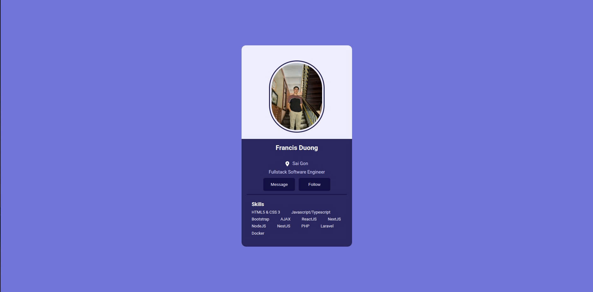

# Personal Profile Card

Mini project for learning basic HTML and CSS by building a personal profile card.

## What I Practiced

- HTML structure
- CSS reset
- Custom font
- Flexbox layout
- Button styling
- Hover effects

## Final Result

